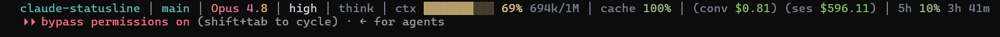

# claude-statusline

[English](README.md) · **Türkçe**

**[Claude Code](https://claude.com/claude-code) için hızlı, sıfır-bağımlılık, yapılandırılabilir bir durum satırı (status line).**

Terminalinizin altında tek satır, her an güncel: hangi modeldesiniz ve reasoning effort seviyeniz, context penceresi ne kadar dolu, oturum ne kadara mal oldu, rate limit'lere ne kadar yakınsınız, git branch, değişen satırlar ve daha fazlası — hepsi Claude Code'un her turda durum satırına verdiği JSON'dan.



```
my-app │ main │ Opus 4.8 │ max │ ctx 18% 185k/1M │ cache 100% │ $0.42 │ +156/-23 │ 12m │ 5h 2% 3h 7m │ 7d 61% 52h 37m
```

Varsayılan **Slate Teal** teması bilinçli olarak sakindir: projeniz ve branch tek bir muted teal, her değer yumuşak nötr, etiketler ve ayraçlar griye çekilir — ve renk yalnızca bir eşik (threshold) tetiklendiğinde belirir (context, cache ve rate limit sarıya/kırmızıya döner). Emoji yok, gökkuşağı yok. İsteğe bağlı bir truecolor **shimmer** model adında hafifçe kayarak sade bir "canlı" vurgu verir.

- **Sıfır bağımlılık** — saf Node.js built-in'leri, render başına tek küçük süreç.
- **Cross-platform** — Windows, macOS, Linux.
- **Varsayılan sade, ayarlanabilir** — tek accent, anlamsal eşik renkleri, 24-bit truecolor + 256 fallback.
- **Her şey bir segment** — herhangi bir parçayı tek dizide aç/kapa ve yeniden sırala.
- **Oturumunu asla bozmaz** — her alan opsiyonel, her hata yutulur; bozuk bir durum satırı Claude Code'u çökertemez.
- **`NO_COLOR`'a saygılı** ve temiz şekilde düz metne düşer.

---

## Gereksinimler

- `PATH`'inde Node.js **18+** (`node --version`)
- Durum satırı özelliği olan Claude Code (yakın herhangi bir sürüm)

> **Yalnızca CLI / terminal.** Durum satırı bir Claude Code **terminal** özelliğidir; bu yüzden CLI'da ve herhangi bir terminalde çalışır — VS Code'un *entegre terminalinde* `claude` çalıştırmak dahil. IDE eklentilerinin **native panellerinde** (VS Code / JetBrains) **render olmaz**, çünkü onlar `statusLine`'ı henüz desteklemiyor ([açık feature request](https://github.com/anthropics/claude-code/issues/55643)). VS Code'da terminal moduna geçmek için `"claudeCode.useTerminal": true` ayarlayabilirsin.

## Kurulum

**Tek komut** — klonla ve kur:

```bash
git clone https://github.com/slckarslan93/claude-statusline.git && cd claude-statusline && node install.js
```

Sonra **Claude Code'u yeniden başlat** (veya `/statusline` çalıştır) → durum satırı altta belirir. Hepsi bu.

> Zaten Claude Code içinde misin? Aynı satırı başına `!` koyarak burada çalıştır: `! git clone …/claude-statusline.git && cd claude-statusline && node install.js`

Kurucu (installer), düzenleyebileceğin bir config'i `~/.claude/claude-statusline/config.json`'a bırakır, `~/.claude/settings.json`'ın (zaman damgalı) yedeğini alır ve `statusLine` komutunu bu araca ayarlar — yıkıcı olmadan (geçersiz bir `settings.json`'a dokunmak yerine iptal eder).

> Zaten bir `statusLine`'ın var mı? Kurucu eski komutu yazdırır ve yedekte tutar. İkisini birden çalıştırmak için önceki komutunu bir wrapper'dan çağır ya da çıktısını özel bir segment olarak ekle.

### Manuel kurulum

Kendin bağlamak istersen, `~/.claude/settings.json`'a şunu ekle:

```json
{
  "statusLine": {
    "type": "command",
    "command": "node \"/absolute/path/to/claude-statusline/bin/claude-statusline.js\""
  }
}
```

## Yapılandırma (Configuration)

[`config.example.json`](./config.example.json)'ı `~/.claude/claude-statusline/config.json`'a kopyala (kurucu bunu senin için yapar) ve düzenle. `CLAUDE_STATUSLINE_CONFIG` ortam değişkeni ile config'i başka bir yere de gösterebilirsin. Config **JSONC**'dir — `//` ve `/* */` yorumları serbesttir (gönderilen örnek dosya açıklamalıdır), böylece her seçeneğin ne yaptığını satır içinde not edebilirsin.

`segments` dizisi işin kalbidir — **ne gösterileceğini ve hangi sırayla** kontrol eder. İstemediğin isimleri sil, serbestçe yeniden sırala; verisi olmayan bir segment hiçbir şey render etmez.

```json
{
  "segments": ["dir", "git", "model", "fast", "effort", "thinking",
               "context", "cache", "cost", "lines", "rate5h", "pr", "agent"],
  "separator": " ",
  "divider": "│",
  "colors": true,
  "truecolor": true,
  "icons": false,
  "gradient": { "enabled": false, "appliesTo": "model", "periodMs": 5000, "spread": 0.55,
                "stops": ["#F6C46F", "#F38868", "#E56C8A", "#D879BB"] },
  "context": { "bar": true, "barWidth": 10, "showTokens": true, "showSize": true, "warnAt": 50, "critAt": 80, "warn200k": false },
  "cache": { "warnAt": 40, "critAt": 70 },
  "rate": { "warnAt": 50, "critAt": 80, "countdown": true },
  "cost": { "decimals": 2, "showSession": true, "showTask": false, "taskLabel": "task" },
  "duration": { "showApi": false },
  "git": { "enabled": true, "timeoutMs": 250, "showRepo": true },
  "dir": { "useProjectDir": false },
  "caveman": { "enabled": false }
}
```

| Anahtar | Varsayılan | Anlamı |
|-----|---------|---------|
| `segments` | yukarı bak | Hangi segmentlerin, hangi sırayla render edileceği |
| `separator` | `" "` | Ayracın çevresine konan boşluk |
| `divider` | `"│"` | Segmentler arası çizilen dim karakter (boş = yok) |
| `colors` | `true` | ANSI renk; `false` veya `NO_COLOR` env → düz metin |
| `truecolor` | `true` | 24-bit renk; `false` → 256-index fallback |
| `icons` | `false` | `true` → metin teması yerine emoji |
| `gradient.enabled` | `false` | Model adında render-başına shimmer (yalnız truecolor) |
| `gradient.appliesTo` | `"model"` | Shimmer nereye: `model` veya `dir` |
| `gradient.periodMs` | `5000` | Kayma hızı — düşük = render başına daha hızlı kayar |
| `gradient.spread` | `0.55` | Rampanın metnin ne kadarını kapladığı |
| `gradient.stops` | amber→magenta | Shimmer için sıralı hex renk durakları |
| `context.bar` / `barWidth` | `true` / `10` | `▓▓░░` doluluk çubuğu ve genişliği |
| `context.showTokens` / `showSize` | `true` / `true` | `185k` ve `/1M` ekle |
| `context.warnAt` / `critAt` | `50` / `80` | Yüzde eşikleri → sarı / kırmızı |
| `context.warn200k` | `false` | `exceeds_200k_tokens`'ta `200k!` işareti (1M context'te gürültü) |
| `cache.warnAt` / `critAt` | `40` / `70` | Cache-isabet eşikleri (yüksek = iyi) |
| `rate.warnAt` / `critAt` | `50` / `80` | Rate-limit eşikleri → sarı / kırmızı |
| `rate.countdown` | `true` | Her pencerenin sıfırlanmasına kalan süreyi göster |
| `cost.decimals` | `2` | USD ondalık basamak sayısı |
| `cost.showSession` | `true` | Oturum toplamını göster |
| `cost.showMessage` | `false` | Mesaj-başı rakamı da göster (`--mark-message` hook gerekir) |
| `cost.showTask` | `false` | Sıfırlanabilir baz noktasından task rakamını da göster |
| `cost.messageLabel` | `"msg"` | Mesaj-başı rakamın etiketi, örn. `(msg $0.02)` |
| `cost.taskLabel` | `"task"` | Task rakamının etiketi, örn. `(task $2.10)` |
| `cost.sessionLabel` | `""` | Boş → çıplak `$549`; ör. `"ses"` → `(ses $549)` |
| `lines.showTask` | `false` | Session toplamı yerine `--reset-cost`'tan beri (bu konuşma) değişen satırlar |
| `duration.showApi` | `false` | API-only süreyi de göster |
| `git.enabled` | `true` | Branch'i okumak için `git` çalıştır |
| `git.timeoutMs` | `250` | git çağrısında bu süreden sonra vazgeç |
| `git.showRepo` | `true` | Payload'daki repo adını ekle |
| `dir.useProjectDir` | `false` | `false` → mevcut dizin; `true` → açılış dizini |
| `caveman.enabled` | `false` | [caveman](https://github.com/JuliusBrussee/caveman) plugin modu rozetini (aktifse) başa ekle |

### Segmentleri açma ve kapatma

Her şey tek yerden ayarlanır — `segments` dizisi. **Varsayılan set:**

```
dir · git · model · fast · effort · thinking · context · cache · cost · lines · rate5h · pr · agent
```

- Bir segmenti **kapat** → ismini `segments`'ten sil.
- Varsayılan kapalı olanı **aç** → görünmesini istediğin yere ismini ekle.
- **Yeniden sırala** → isimleri taşı; dizideki sıra satırdaki sıradır.

Kullanılabilir ama **varsayılan kapalı** (açmak için ismi ekle):

| Segment | Gösterir |
|---------|-------|
| `duration` | Oturum süresi (wall-clock) |
| `rate7d` | 7-günlük rate limit + reset |
| `session` | Özel oturum adı (`--name` / `/rename`) |
| `outputStyle` | `default` olmayan output style |
| `vim` | Vim modu |
| `version` | Claude Code sürümü |

Mevcut oturum için verisi olmayan bir segment hiçbir şey render etmez; bu yüzden `pr`, `agent` ve `rate*` segmentleri yalnız gerçekten geçerli olduklarında yer kaplar. Dosyayı kaydet, bir sonraki render alır — restart gerekmez.

### Birden fazla satır

`segments` bir **dizi-dizisi** de olabilir — her iç dizi kendi satırı olur. Bir parçanın tam terminal genişliğini tek başına almasını istediğinde işe yarar:

```json
{
  "segments": [
    ["caveman"],
    ["dir", "git", "model", "effort", "context", "cache", "cost", "rate5h", "rate7d"]
  ]
}
```

iki satır olarak render olur:

```
[CAVEMAN]
my-app │ main │ Opus 4.8 │ max │ ctx 18% 185k/1M │ cache 100% │ $0.42 │ 5h 2% 3h 7m │ 7d 61% 52h 37m
```

Boş render olan bir satır (ör. caveman aktif değilken caveman rozeti) düşürülür, böylece boş bir satır kalmaz.

### Satır kaydırma (Wrapping)

Varsayılan olarak her mantıksal satır **terminal genişliğine göre kaydırılır**; böylece hiçbir segment kesilmez — satır çok uzunsa taşma bir alt satıra akar, kesilmez. Genişlik gerçek terminal hücreleriyle ölçülür (ANSI renk kodları yok sayılır, emoji 2 sayılır) ve segmentler ortadan bölünmez.

Genişlik otomatik tespit edilir. Durum satırı hook'unda stdout bir TTY olmadığından, otomatik tespit boş dönerse `wrap.fallbackWidth`'e düşer. Kaydırma terminaline uymuyorsa açık bir genişlik ver:

```json
{ "wrap": { "enabled": true, "maxWidth": 120, "fallbackWidth": 100 } }
```

| Anahtar | Varsayılan | Anlamı |
|-----|---------|---------|
| `wrap.enabled` | `true` | Genişliğe kaydır; `false` → tek satır, terminal keser |
| `wrap.maxWidth` | `0` | `0` = otomatik tespit; bir sayı o genişliği zorlar |
| `wrap.fallbackWidth` | `100` | Yalnız otomatik tespit boş dönünce kullanılır |

### Shimmer

Varsayılan kapalı. Açıldığında, bir accent öğesi boyunca (model adı veya `dir`) kod-noktası başına bir truecolor gradient boyanır ve rampa saat-tabanlı bir fazla kaydırılır; böylece **her render'da biraz kayar** — statik blok yerine sessiz, canlı bir vurgu. Kare-kare animasyon değildir (durum satırı yalnız tur başına yeniden render olur), sadece zamanla nazik bir kayma.

```json
{ "gradient": { "enabled": true, "appliesTo": "model" } }
```

Truecolor bir terminal gerektirir (Windows Terminal, VS Code, iTerm, çoğu modern emülatör). Truecolor yoksa düz bir renge, `NO_COLOR` altında düz metne düşer. Genişliği etkilemez — renk kodları ölçümde soyulur, kaydırma hizada kalır.

## Segmentler

| İsim | Gösterir | Kaynak |
|------|-------|--------|
| `dir` | Çalışma dizini adı | `workspace.current_dir` / `project_dir` |
| `git` | Mevcut branch (+ repo) | `git branch --show-current`, `workspace.repo` |
| `model` | Sadeleştirilmiş model, örn. `Opus 4.8` | `model.id` / `display_name` |
| `fast` | Opus fast mode açıkken `FAST` | `fast_mode` |
| `effort` | Reasoning effort `low`…`max` | `effort.level` |
| `thinking` | Extended thinking açıkken `think` | `thinking.enabled` |
| `context` | Bar + yüzde + token + boyut | `context_window.*` |
| `cache` | Prompt-cache isabet oranı | `context_window.current_usage` |
| `cost` | Oturum maliyeti ve/veya task-başı rakam | `cost.total_cost_usd` |
| `lines` | Eklenen / çıkan satır (session veya konuşma-başı) | `cost.total_lines_*` |
| `duration` | Wall-clock (ve API) süre | `cost.total_duration_ms` |
| `rate5h` | 5-saatlik limit + reset geri sayımı | `rate_limits.five_hour` |
| `rate7d` | 7-günlük limit + reset geri sayımı | `rate_limits.seven_day` |
| `pr` | Açık PR numarası + review durumu | `pr.*` |
| `agent` | Aktif subagent adı | `agent.name` |
| `outputStyle` | Default olmayan output style | `output_style.name` |
| `session` | Özel oturum adı | `session_name` |
| `vim` | Vim modu | `vim.mode` |
| `version` | Claude Code sürümü | `version` |
| `caveman` | caveman plugin modu rozeti | `~/.claude/.caveman-active` okur |

Bazı alanlar yalnız bazı oturumlarda görünür — `rate_limits` bir Pro/Max aboneliği ve ilk API yanıtını ister, `effort` yalnız destekleyen modellerde, `pr` yalnız açık bir PR varken, `agent` yalnız `--agent` altında ve `current_usage` `/compact` hemen sonrası `null`'dır. Her segment yokluğu hiçbir şey render etmeyerek karşılar.

### Maliyet: message, task, session

`cost` segmenti küçükten büyüğe üç iç içe rakam gösterebilir, örn. `(msg $0.02) (conv $2.10) (ses $525.04)`:

```
session  ⊃  task  ⊃  message
```

| Seviye | Aç | Kapsar | Sıfırlanma |
|-------|--------|--------|--------|
| **message** | `showMessage` | Tek alışveriş (bu mesaj + yanıtı) | Otomatik, her kullanıcı mesajının başında (aşağıdaki hook gerekir) |
| **task** | `showTask` | Mesaj grubu — bir task ya da konuşma | Manuel, `--reset-cost` ile — yeni bir işe başlarken çalıştır |
| **session** | `showSession` (varsayılan açık) | Tüm Claude Code oturumu (açılış → `/clear`) | Yalnız yeni oturum / `/clear` |

Örnek akış, bir işin başında `task`'ı sıfırladıktan sonra:

| Yazdığın | `msg` | `task` |
|----------|-------|--------|
| "minimal yap" | $0.30 | $0.30 |
| "emojiyi kaldır" | $0.20 | $0.50 |
| "maliyet ekle" | $0.40 | $0.90 |

`msg` her zaman yalnız mevcut mesaj; `task` sen sıfırlayana kadar birikir.

Etiketler `messageLabel` / `taskLabel` / `sessionLabel` ile ayarlanır (`sessionLabel` boşken `session` çıplak `$549`, adlandırdığında `(ses $549)` gösterir). Üçü de aynı client-side tahmindir — eşdeğer API maliyeti — ve her biri oturumun faturaladığı **her şeyi** kapsar: girdilerini, modelin çıktısını, tool çağrılarını ve yolda başlatılan sub-agent'ları veya workflow'ları (yalnız senin mesajların değil).

**Mesaj-başı maliyet bir hook gerektirir.** Claude Code durum satırına mesaj-başı bir işaret vermez; bu yüzden mesaj maliyeti, her mesajın başında `--mark-message` çalıştıran bir `UserPromptSubmit` hook'u ile sıfırlanır. `~/.claude/settings.json`'a ekle (mevcut hook'larla birleştir):

```json
{
  "hooks": {
    "UserPromptSubmit": [
      { "hooks": [ { "type": "command",
        "command": "node \"/abs/path/claude-statusline/bin/claude-statusline.js\" --mark-message" } ] }
    ]
  }
}
```

Hook olmadan `showMessage` yalnızca oturum-başı bir baz noktası gibi davranır.

**Task maliyeti** manuel bir task / konuşma-başı rakamdır — yeni bir işe başlarken çalıştır, `$0.00`'dan sayar:

```bash
node bin/claude-statusline.js --reset-cost   # veya: npm run reset-cost
```

`--reset-cost` aynı zamanda **`lines`** sayacını da sıfırlar; böylece `"lines": { "showTask": true }` ile `+156/-23` rakamı, tüm oturum toplamı yerine yalnız **mevcut konuşmada** değişen satırları (istediğin değişikliği) gösterir.

## Rakamlar hakkında notlar

- **Context %** Claude Code'un kendi `used_percentage`'ıdır; yalnız input token'larından (input + cache read + cache write) hesaplanır, uygulamada görünenle eşleşir.
- **Cost**, Claude Code'un client-side tahminidir (`total_cost_usd`) — uygulamanın izlediği rakamın aynısı. Eşdeğer API fiyatlamasının tahminidir ve gerçek faturadan sapabilir.
- **Cache isabet oranı** son turda `cache_read / (input + cache_write + cache_read)`'tir — prompt caching'in ne kadar iyi çalıştığının hızlı bir göstergesi (yüksek = iyi).

## Dene

```bash
node bin/claude-statusline.js < test/sample.json
```

Veya kendi mock'unla:

```bash
echo '{"model":{"id":"claude-sonnet-4-6"},"context_window":{"used_percentage":25,"total_input_tokens":50000,"context_window_size":200000}}' | node bin/claude-statusline.js
```

## Kaldırma (Uninstall)

```bash
node install.js --uninstall
```

Yalnız bizim `statusLine` girdimizi kaldırır (yedek aldıktan sonra) ve `settings.json`'daki her şeyi olduğu gibi bırakır. Config klasörün yerinde kalır; onu da silmek için `~/.claude/claude-statusline/`'ı sil.

## Nasıl çalışır

Claude Code, `statusLine` komutunu her turdan sonra çalıştırır ve oturumun bir JSON anlık görüntüsünü stdin'den ona verir. Bu araç o JSON'ı ayrıştırır, `segments` listeni gezer, her birini küçük renkli bir dizeye render eder ve satır(lar)ı yazar. Ağ çağrısı yok; yazdığı tek şey `~/.claude/claude-statusline/` altındaki opsiyonel task-başı maliyet baz noktasıdır. Tam payload şeması için [status line dokümanları](https://code.claude.com/docs/en/statusline)na bak.

## Lisans

[MIT](./LICENSE)
